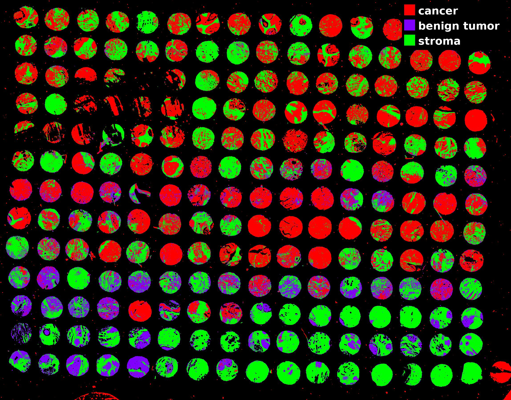

# Tissue classification from spectral images using machine learning

## Project Overview

This project explores the use of machine learning techniques to classify tissue samples into three categories: **cancer**, **benign tumor**, and **stroma**. The primary objective was to build a model capable of predicting the health status of tissue fragments based on hyperspectral image data.

## Data Description

The dataset includes a spectral image (`tissue.tiff`) containing tissue samples collected from multiple patients. Each pixel in the image represents a location in the tissue with associated spectral measurements. These measurements serve as the input features for the classification model.

## Methodology

The project followed a multi-step pipeline:

- **Annotation**: Using ImageJ, each region of the tissue image was manually annotated and assigned to one of three classes: *cancer*, *benign tumor*, or *stroma*. These annotations were used to create binary masks for supervised learning.
  
- **Preprocessing**: Custom utilities were used to clean and generate masks indicating which pixels belong to which tissue class. To ensure class balance during training, the number of pixels sampled from each class was equalized.

- **Feature Extraction**: Spectral data were extracted from the annotated regions using a memory-mapped hyperspectral image file. Only a fixed number of pixels per class were used, based on the smallest available class.

- **Model Training**: A Random Forest classifier was trained to distinguish between the three classes using the extracted pixel-level spectral features. The dataset was split into training and test sets for evaluation.

## Output

The final classification map visualizes the spatial distribution of cancerous, benign, and stromal tissue across the entire sample. This result demonstrates the potential of combining hyperspectral imaging with machine learning for digital pathology and cancer diagnostics.

